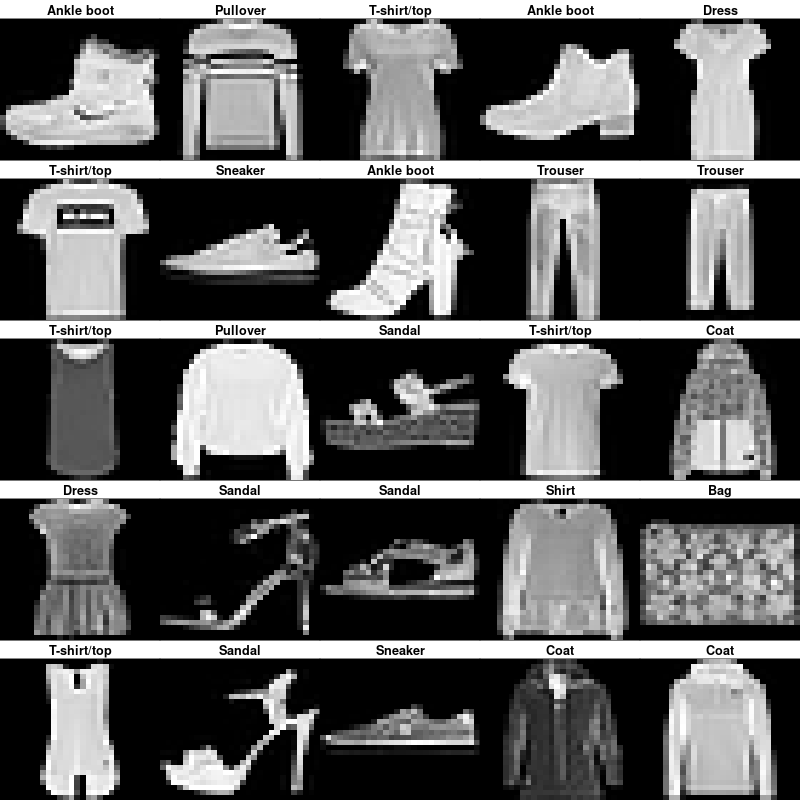
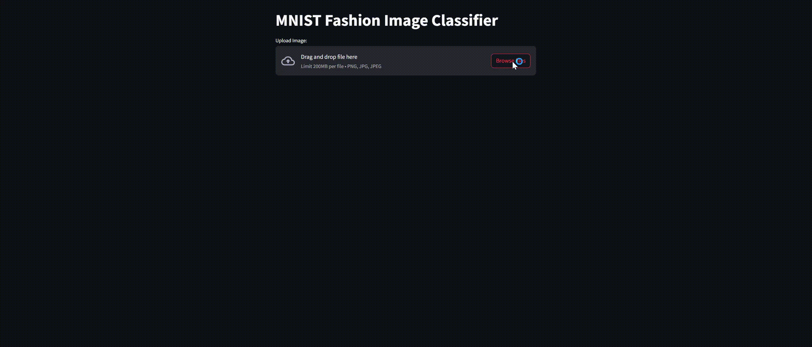

# Fashion-MNIST-PyTorch-Streamlit
Transfer Learning multiple CNN Models to Classify Fashion MNIST dataset in PyTorch and inference model using Streamlit

<details><summary>Table of Contents</summary><p>

1. [Installation](https://github.com/piput-setyono/Fashion-MNIST-PyTorch-Streamlit#installation)
2. [Usage](https://github.com/piput-setyono/Fashion-MNIST-PyTorch-Streamlit#usage)
3. [Demo](https://github.com/piput-setyono/Fashion-MNIST-PyTorch-Streamlit#demo)
4. [Experiments](https://github.com/piput-setyono/Fashion-MNIST-PyTorch-Streamlit#experiments)
5. [Results](https://github.com/piput-setyono/Fashion-MNIST-PyTorch-Streamlit#results)
6. [Conclusion](https://github.com/piput-setyono/Fashion-MNIST-PyTorch-Streamlit#conclusion)
6. [Improvement](https://github.com/piput-setyono/Fashion-MNIST-PyTorch-Streamlit#improvement)
8. [Reference](https://github.com/piput-setyono/Fashion-MNIST-PyTorch-Streamlit#reference)
</p></details><p></p>

[Fashion-MNIST](https://github.com/zalandoresearch/fashion-mnist) is a dataset for fashion product classification. It consists of 7.000 images of 10 different classes split in a training dataset of 60.000 images and a testing dataset of 10.000 images. Deep learning models reach ~95% accuracy of the [official benchmark](https://github.com/zalandoresearch/fashion-mnist#benchmark). We want to train similar models reaching a similar accuracy and being "efficient" enough to be implemented in regular computer / mobile device.

We have three different objectives with this exploration:

1. Train different models architectures using different input image format.
2. Discuss the results of the different experiments.
3. Create a demo to use the trained models using Streamlit.



_Different examples of the Fashion-MNIST's classes ([source](https://cran.r-project.org/web/packages/keras/vignettes/tutorial_basic_classification.html))._

## Installation

We recommend using an isolated Python environment, such as [venv](https://docs.python.org/3/library/venv.html) or [conda](https://docs.conda.io/en/latest/) with at least **Python 3.6**. Then, use the following lines of code:

```
git clone https://github.com/piput-setyono/Fashion-MNIST-PyTorch-Streamlit.git
cd Fashion-MNIST-PyTorch
python3 -m venv .env
source .env/bin/activate
pip install -r requirements.txt
```

### Install PyTorch

As the installation for PyTorch is different for each platform, please have a look at the [PyTorch installation guide](https://pytorch.org/get-started/locally/).

## Usage

Once the installation process is finished, use the `train_model.py` script to reproduce the results of the different experiments.

To get more information about the `train_model.py` script, use the following line in your terminal:

```
python train_model.py --help
```

To use the Demo, see the [Demo](https://github.com/piput-setyono/Fashion-MNIST-PyTorch-Streamlit#demo) section of this Readme.

### Repository Structure

The repository contains five different folders:

- **data** : this directory will be created when executing the `train_model.py` script for the first time. It will contain the Fashion MNIST's train and test datasets.
- **models** : this directory contains trained model that will be used in application.
- **images** : this directory contains the images used in this README.
- **log** : This directory contains model training logs which can be used to analyze model training results and future improvements.

## Demo

In order to see how our models would perform on real data, we have created a small demo. This Demo can be used with all the models trained using this repository.


_**Video 1**: The Demo classifying using Fashion MNIST Dataset Test._



_**Video 2**: The demo used images outside of Fashion MNIST Dataset._

### Launch the Application

Launch the Demo with the following command:

```
streamlit run application.py
```

Once the application is running, the application can be used to classify images with the following stages:

1. Click Browse Files


2. Click Run Prediction


3. The classification results will be visible along with the heat map


## Experiments

### Models

We use several model architectures in this experiment, namely:

1. ResNet50
2. MobilenetV2
3. MobilenetV3 (Small & Large)
4. VGG16 (in progress)

### Input Images into model

In this experiment, each model was made into 2 different models to receive different input images, namely 2 layer images (grayscale) and 3 layers (grayscale in RGB images, by duplicating the data into 3 layers)

## Results

In this experiment, each model was trained in 10 epochs, then the best model was taken which had the best F1 score during training.

Results on the test dataset with in each model:

| Model             | Input Images | F1 Score | Best Epoch | Training Time in 10 epochs (s) | model _state_dict_ size (KB) |
| ----------------- | ------------ | -------- | ---------- | ------------------------------ | ---------------------------- |
| ResNet50          | 2 layer      | 0.9231   |      9     |  526.2751317024231             | 92.205                       |
| ResNet50          | 3 layer      | 0.9325   |      6     |  550.8460876941681             | 92.229                       |
| MobileNetV2       | 2 layer      | 0.9321   |     10     | 1529.3635387420654             |  8.985                       |
| MobileNetV2       | 3 layer      | 0.9372   |      4     | 1597.850979566574              |  9.987                       |
| MobileNetV3_small | 2 layer      | 0.9265   |     10     |  690.6068074703217             |  6.108                       |
| MobileNetV3_small | 3 layer      | 0.9361   |      7     |  777.5125722885132             |  6.109                       |
| MobileNetV3_large | 2 layer      | 0.9315   |      4     | 1591.792223930359              | 16.683                       |
| MobileNetV3_large | 3 layer      | 0.9355   |      9     | 1325.0456538200378             | 16.684                       |

## Conclusion

After conducting those experiments, the application used MobileNetV3_small with input 3 layer images for the best F1 score, training time, size model and future improvements in a faster time. We can change the model in the application by changing the name of the model file in the _application.py_ code

## Improvement

To be able to improve the performance of the model used in the application, there are several points for future improvement as follows:
1. Add variations in data transformation/augmentation to the training process
2. Increase the number of epochs in training
3. Try other models (such as VGG16)

## Reference
- **PyTorch CNN**<br/>
[1] [https://github.com/piput-setyono/Fashion-MNIST-PyTorch-Streamlit/blob/master/train_fashionMNIST.py](https://github.com/piput-setyono/Fashion-MNIST-PyTorch-Streamlit/blob/master/train_fashionMNIST.py)<br/>
[2] [https://colab.research.google.com/github/kjamithash/Pytorch_DeepLearning_Experiments/blob/master/FashionMNIST_ResNet_TransferLearning.ipynb#scrollTo=Lsbcb_WgFx3c](https://colab.research.google.com/github/kjamithash/Pytorch_DeepLearning_Experiments/blob/master/FashionMNIST_ResNet_TransferLearning.ipynb#scrollTo=Lsbcb_WgFx3c)

- **Inference in Streamlit**<br/>
[3] [https://www.python-engineer.com/posts/pytorch-style-transfer-streamlit/](https://www.python-engineer.com/posts/pytorch-style-transfer-streamlit/)<br/>
[4] [https://towardsdatascience.com/create-an-image-classification-web-app-using-pytorch-and-streamlit-f043ddf00c24](https://towardsdatascience.com/create-an-image-classification-web-app-using-pytorch-and-streamlit-f043ddf00c24)<br/>
[5] [https://www.youtube.com/watch?v=McJPXgWmSDY](https://www.youtube.com/watch?v=McJPXgWmSDY)<br/>
[6] [https://github.com/Sandeep-Yadav2/Fashion-MNIST-dataset-classification/tree/main](https://github.com/Sandeep-Yadav2/Fashion-MNIST-dataset-classification/tree/main)
